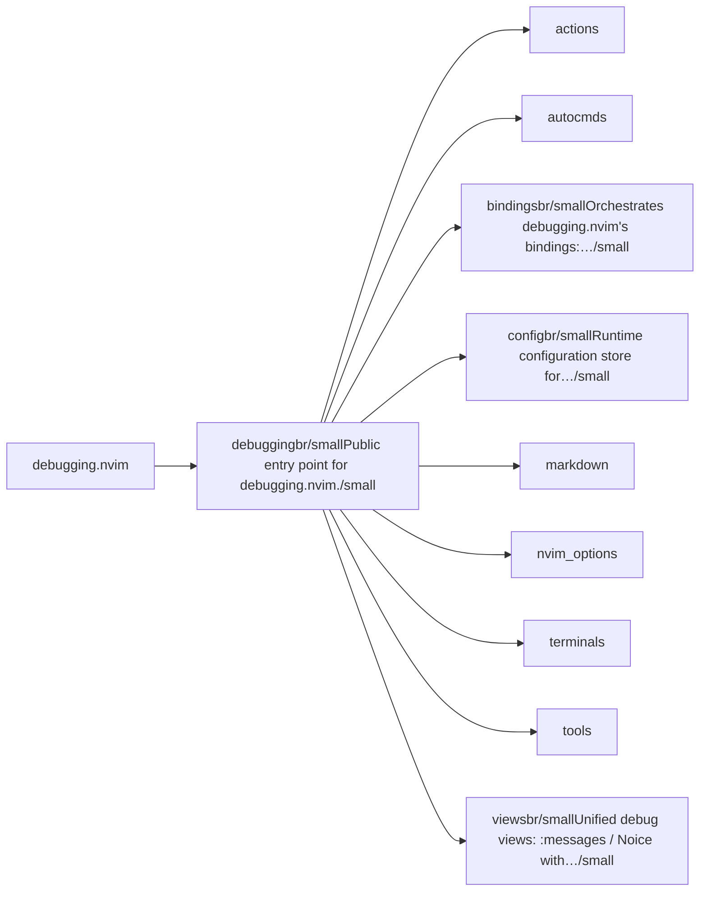
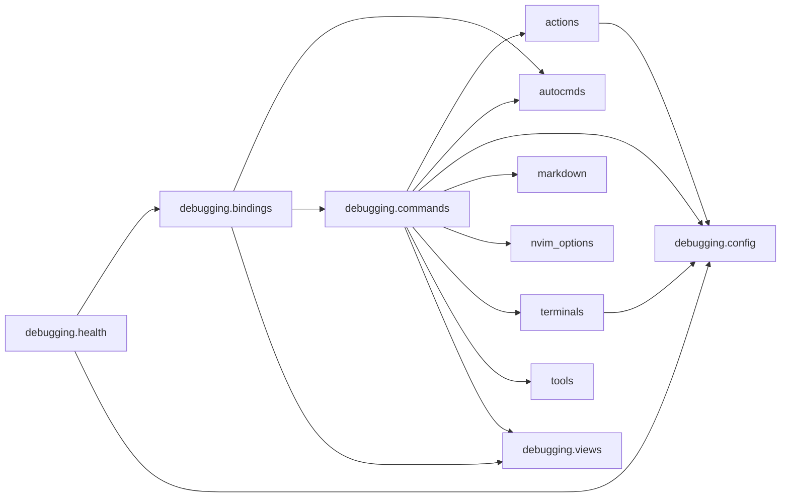

# debugging.nvim — module map

> **Generated** by `documentation`. Do not edit by hand — run `:DocMap`
> (or `nvim --headless -l scripts/gen_map.lua`) to regenerate.

**8 modules** · 8 namespaces · 21 helper files

The [interactive map](index.html) has filtering, full descriptions and
source links; this page is the version the code host renders directly.

## Namespaces

## Dependencies

Which parts of the tree require which, rolled up to the second level.
The [interactive map](index.html)'s **Deps** view has this per module,
in both directions, with load-time and lazy requires told apart.

## Modules

| Module | Description | Fns | Docs |
|---|---|---|---|
| `debugging` | Public entry point for debugging.nvim. | 1 | [src](../../lua/debugging/init.lua) |
| &nbsp;&nbsp;`actions` |  |  |  |
| &nbsp;&nbsp;`autocmds` |  |  |  |
| &nbsp;&nbsp;`debugging.bindings` | Orchestrates debugging.nvim's bindings: usercmds, keymaps, autocmds, which-key. | 1 | [src](../../lua/debugging/bindings/init.lua) |
| &nbsp;&nbsp;`debugging.config` | Runtime configuration store for debugging.nvim. | 2 | [src](../../lua/debugging/config/init.lua) |
| &nbsp;&nbsp;`markdown` |  |  |  |
| &nbsp;&nbsp;`nvim_options` |  |  |  |
| &nbsp;&nbsp;`terminals` |  |  |  |
| &nbsp;&nbsp;`tools` |  |  |  |
| &nbsp;&nbsp;&nbsp;&nbsp;`debugging.tools.buffer_inspector` | Inspect buffer / window / tab scoped options and state for debugging. | 3 | [src](../../lua/debugging/tools/buffer_inspector/init.lua) |
| &nbsp;&nbsp;&nbsp;&nbsp;`cursor` |  |  |  |
| &nbsp;&nbsp;&nbsp;&nbsp;`debugging.tools.vardump` | Recursively dump a global Lua variable to a report. | 2 | [src](../../lua/debugging/tools/vardump/init.lua) |
| &nbsp;&nbsp;`debugging.views` | Unified debug views: :messages / Noice with capture, display, windows. | 9 | [src](../../lua/debugging/views/init.lua) |
| &nbsp;&nbsp;&nbsp;&nbsp;`debugging.views.capture` | Unified capture system for :messages, Noice, etc. | 8 | [src](../../lua/debugging/views/capture/init.lua) |
| &nbsp;&nbsp;&nbsp;&nbsp;&nbsp;&nbsp;`debugging.views.capture.clipboard` | Clipboard helper, delegating to lib.nvim.cross.copy_to_clipboard. |  | [src](../../lua/debugging/views/capture/clipboard/init.lua) |

## Drift

0 errors · 0 warnings · 11 info

No errors or warnings.

11 informational findings

| Check | Message |
|---|---|
| `missing-readme` | lua/debugging has no README.md |
| `missing-readme` | lua/debugging/bindings has no README.md |
| `missing-readme` | lua/debugging/config has no README.md |
| `missing-readme` | lua/debugging/tools/buffer_inspector has no README.md |
| `missing-readme` | lua/debugging/tools/vardump has no README.md |
| `missing-readme` | lua/debugging/views has no README.md |
| `missing-readme` | lua/debugging/views/capture has no README.md |
| `missing-readme` | lua/debugging/views/capture/clipboard has no README.md |
| `undocumented-param` | M.complete has 3 parameter(s) but only 2 @param line(s) |
| `unreferenced-module` | debugging.health is required by no other file in the tree |
| `unreferenced-module` | debugging.views.debug_helper is required by no other file in the tree |

